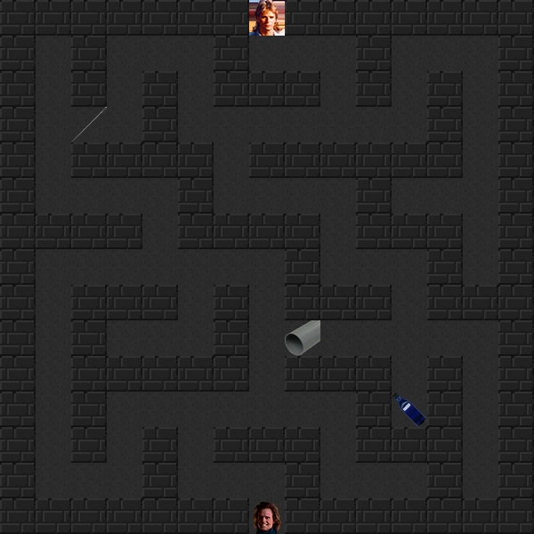

# Project 3: Help MacGyver to escape !



In this Python game, you embody MacGyver and have to recover 3 items inside the maze to benumb the guard (ether, needle and tube).
If you try to escape the maze without all of them, you will lose!

## Installation

Create a virtual environment with the [venv](https://docs.python.org/3/tutorial/venv.html) module to install the game:

```bash
python3 -m venv .venv
```

Then, activate the virtual environment:

```bash
.venv/Scripts/activate
```

Finally, install the dependencies using the package manager [pip](https://pip.pypa.io/en/stable/):

```bash
pip install -r requirements.txt
```

## Usage

### Running game

Run the following command in your terminal:

```bash
python3 main.py
```

You will have to choose playing the game either in the terminal or in [PyGame](https://www.pygame.org/).

### Controls

If you play in terminal, controls are:
- ↑ Z
- ↓ S
- ← Q
- → D

If you play in [PyGame](https://www.pygame.org/), controls are directional arrows.

## License

[WTFPL](https://www.wikipedia.org/wiki/WTFPL)